<div align="center">

# 15 Motion Design Styles

**Fifteen styles, one 10-second film each, all made by Claude Opus 5.5 writing code.**<br>
**15 种 MG 动态设计风格，每种一支 10 秒成片，全部由 Claude Opus 5.5 写代码做出来。**

Every film comes with its style notes, its full prompt and its complete source.<br>
每支片都附风格说明、完整提示词和全部源码。

<a href="https://vincentwei1021.github.io/mg-styles-15/">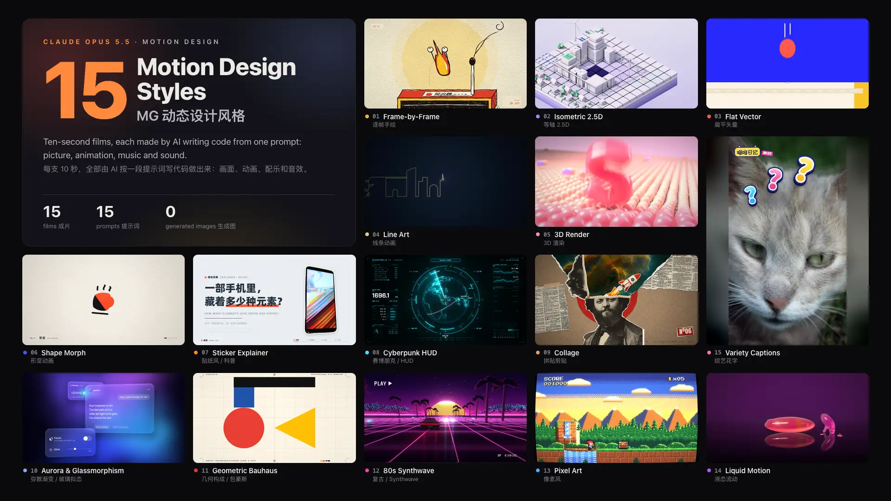</a>

[**▶ Watch all 15 films with sound · 在线观看**](https://vincentwei1021.github.io/mg-styles-15/)

**English** | [简体中文](README.zh-CN.md)

   [](LICENSE) [](https://vincentwei1021.github.io/mg-styles-15/)

</div>

> **中文用户请看这里：[完整中文说明 README.zh-CN.md](README.zh-CN.md)**<br>
> English readers: keep reading below.

## What it is

Fifteen 10-second motion-design films, one style each, from frame-by-frame cel animation to a 9:16 variety-show edit. Claude Opus 5.5 made every film by writing code from a prompt: the picture, the animation, the music and the sound effects. This repository publishes all of it, so you can watch a style, read how it was made, copy its prompt and make a film of your own.

- **No image or video generation.** The picture is code: SVG, Canvas, WebGL and Three.js, with Blender for the 3D film. A few films use CC0 or public-domain photos.
- **The sound is code too.** Each film's `audio.py` synthesises its music and sound effects; the 15 soundtracks draw on 103 recorded instrument samples.
- **Everything is published.** The film, the style notes, the full prompt and the complete source, for all 15 styles.

## How a film is made

<p align="center">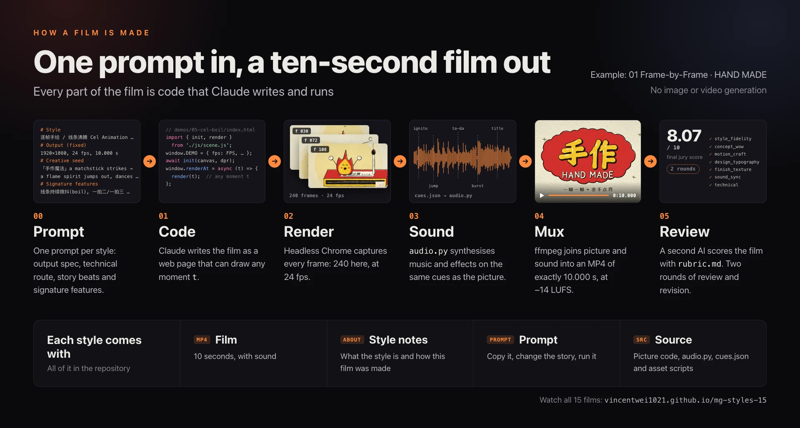</p>

Every film is a web page that draws the frame for any time you give it (`window.renderAt(t)`). The renderer captures each frame in headless Chrome, then ffmpeg joins the frames and the soundtrack. The 3D film is the one exception: Blender renders its picture, and a web page adds the type and grain. Each film went through two rounds of review and revision. Final scores from the AI jury run from 7.57 to 8.21 out of 10.

## The 15 styles

Click a film to watch it with sound on the page.

<table>
<tr>
<td align="center" valign="top" width="33%"><a href="https://vincentwei1021.github.io/mg-styles-15/#05-cel-boil">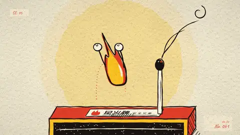</a><br><b>01 · Frame-by-Frame / Line Boil</b><br><sub>HAND MADE</sub><br><sub><a href="prompts/05-cel-boil.md">Prompt</a> · <a href="demos/05-cel-boil">Source</a></sub></td>
<td align="center" valign="top" width="33%"><a href="https://vincentwei1021.github.io/mg-styles-15/#03-isometric">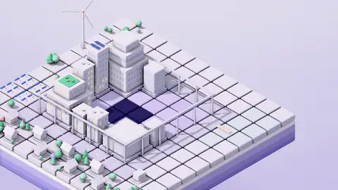</a><br><b>02 · Isometric 2.5D</b><br><sub>ISOPOLIS — Let the City Grow</sub><br><sub><a href="prompts/03-isometric.md">Prompt</a> · <a href="demos/03-isometric">Source</a></sub></td>
<td align="center" valign="top" width="33%"><a href="https://vincentwei1021.github.io/mg-styles-15/#01-flat-vector">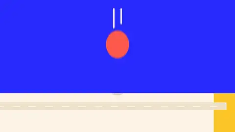</a><br><b>03 · Flat Vector</b><br><sub>popwise — One Dot</sub><br><sub><a href="prompts/01-flat-vector.md">Prompt</a> · <a href="demos/01-flat-vector">Source</a></sub></td>
</tr>
<tr>
<td align="center" valign="top" width="33%"><a href="https://vincentwei1021.github.io/mg-styles-15/#02-line-art">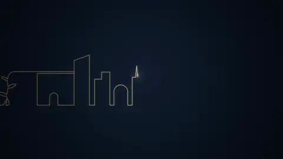</a><br><b>04 · Line Art</b><br><sub>ATELIER LINEA — One Line</sub><br><sub><a href="prompts/02-line-art.md">Prompt</a> · <a href="demos/02-line-art">Source</a></sub></td>
<td align="center" valign="top" width="33%"><a href="https://vincentwei1021.github.io/mg-styles-15/#04-3d-render">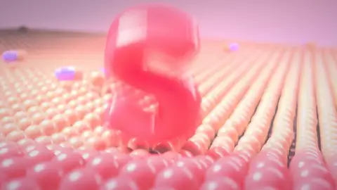</a><br><b>05 · 3D Render</b><br><sub>soft. — Soft Landing · C4D / Blender look</sub><br><sub><a href="prompts/04-3d-render.md">Prompt</a> · <a href="demos/04-3d-render">Source</a></sub></td>
<td align="center" valign="top" width="33%"><a href="https://vincentwei1021.github.io/mg-styles-15/#08-morph">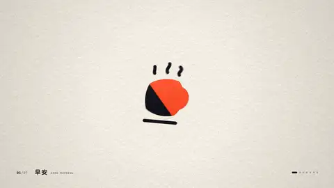</a><br><b>06 · Shape Morph</b><br><sub>morphe. — One Shape, Every Story</sub><br><sub><a href="prompts/08-morph.md">Prompt</a> · <a href="demos/08-morph">Source</a></sub></td>
</tr>
<tr>
<td align="center" valign="top" width="33%"><a href="https://vincentwei1021.github.io/mg-styles-15/#19-paperclip"></a><br><b>07 · Sticker Explainer</b><br><sub>How Many Elements Hide in a Phone?</sub><br><sub><a href="prompts/19-paperclip.md">Prompt</a> · <a href="demos/19-paperclip">Source</a></sub></td>
<td align="center" valign="top" width="33%"><a href="https://vincentwei1021.github.io/mg-styles-15/#22-hud">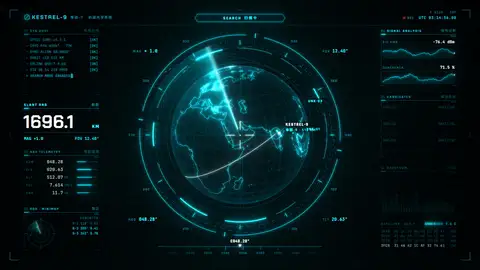</a><br><b>08 · Cyberpunk HUD / FUI</b><br><sub>KESTREL-9 · Target Acquired</sub><br><sub><a href="prompts/22-hud.md">Prompt</a> · <a href="demos/22-hud">Source</a></sub></td>
<td align="center" valign="top" width="33%"><a href="https://vincentwei1021.github.io/mg-styles-15/#06-collage">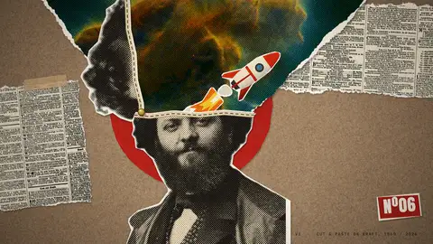</a><br><b>09 · Collage / Cut-out</b><br><sub>NOGGIN Quarterly</sub><br><sub><a href="prompts/06-collage.md">Prompt</a> · <a href="demos/06-collage">Source</a></sub></td>
</tr>
<tr>
<td align="center" valign="top" width="33%"><a href="https://vincentwei1021.github.io/mg-styles-15/#12-aurora-glass">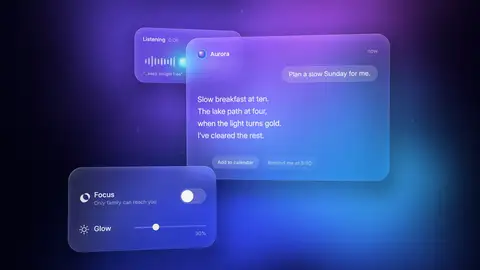</a><br><b>10 · Aurora &amp; Glassmorphism</b><br><sub>Aurora — Think in Light</sub><br><sub><a href="prompts/12-aurora-glass.md">Prompt</a> · <a href="demos/12-aurora-glass">Source</a></sub></td>
<td align="center" valign="top" width="33%"><a href="https://vincentwei1021.github.io/mg-styles-15/#09-bauhaus">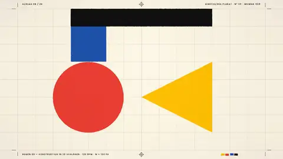</a><br><b>11 · Geometric Bauhaus</b><br><sub>KONSTRUKTION · 20 Beats</sub><br><sub><a href="prompts/09-bauhaus.md">Prompt</a> · <a href="demos/09-bauhaus">Source</a></sub></td>
<td align="center" valign="top" width="33%"><a href="https://vincentwei1021.github.io/mg-styles-15/#10-synthwave">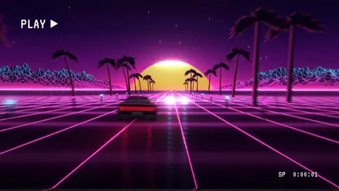</a><br><b>12 · 80s Synthwave / VHS</b><br><sub>NEON DRIVE — Midnight 1986</sub><br><sub><a href="prompts/10-synthwave.md">Prompt</a> · <a href="demos/10-synthwave">Source</a></sub></td>
</tr>
<tr>
<td align="center" valign="top" width="33%"><a href="https://vincentwei1021.github.io/mg-styles-15/#20-pixel">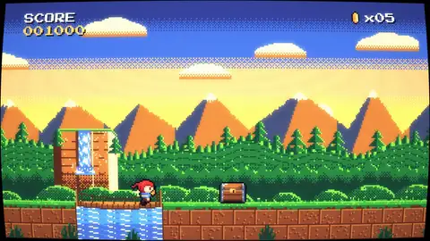</a><br><b>13 · Pixel Art</b><br><sub>PIXEL QUEST</sub><br><sub><a href="prompts/20-pixel.md">Prompt</a> · <a href="demos/20-pixel">Source</a></sub></td>
<td align="center" valign="top" width="33%"><a href="https://vincentwei1021.github.io/mg-styles-15/#07-liquid">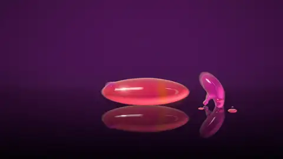</a><br><b>14 · Liquid Motion</b><br><sub>drop. — It All Starts with a Drop</sub><br><sub><a href="prompts/07-liquid.md">Prompt</a> · <a href="demos/07-liquid">Source</a></sub></td>
<td align="center" valign="top" width="33%"><a href="https://vincentwei1021.github.io/mg-styles-15/#18-hanazi"></a><br><b>15 · Variety Captions</b><br><sub>Miaowu Diary EP.07 · 9:16 vertical</sub><br><sub><a href="prompts/18-hanazi.md">Prompt</a> · <a href="demos/18-hanazi">Source</a></sub></td>
</tr>
</table>

On the page, each style has its own section: the film, what the style is and how this film was made. Below it, one click opens the full prompt or a browser for every source file. The page switches between English and Chinese.

[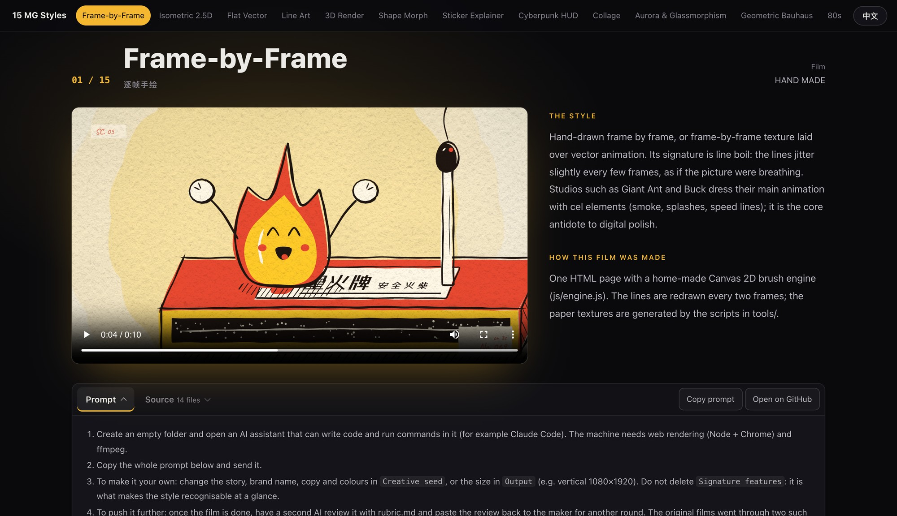](https://vincentwei1021.github.io/mg-styles-15/)

## Make a film from a prompt

1. Open an AI assistant that can write code and run commands (for example Claude Code) in an empty folder. The machine needs Node, Chrome and ffmpeg; the suggested route for the 3D style uses Blender.
2. Open any file in `prompts/` and send the whole prompt block.
3. To make it your own: only `Creative seed` is a specific story. Replace its story, brand name, copy and colours with yours, or change `Output` to vertical 1080×1920 or another length. Keep `Signature features`: it is what makes the style recognisable at a glance.
4. To push it further: once the film is done, have a second AI review it with [rubric.md](rubric.md) and paste the review back for another round. The original films went through make → review → revise twice.
5. To write a new style: fill in the four sections of [template.md](template.md) (output spec, technical route, creative seed, signature features) and copy the shared parts as they are.

To save effort, you can also point the AI at this repository's `harness/render.mjs` for rendering and `lib/audio` for the soundtrack, instead of building both from scratch.

## Run the source

| Needs | For | How |
|---|---|---|
| Node.js 22.12 or later | The renderer and the films' npm packages | [nodejs.org](https://nodejs.org), then `npm install` |
| Google Chrome | Capturing frames headlessly | Found in its default macOS location; elsewhere set `MG_CHROME=<path>` |
| ffmpeg | Joining picture and sound | `brew install ffmpeg` or `sudo apt install ffmpeg` |
| Python 3.11 or later | The soundtracks (`audio.py`) and the asset scripts | `pip install -r requirements.txt` |
| Blender | Only the 3D film | [demos/04-3d-render/README.md](demos/04-3d-render/README.md) |
| The fonts | Lettering that matches the films | Not in the repository; [assets/fonts/README.md](assets/fonts/README.md) lists them |

```bash
# from the repository root
npm install
pip install -r requirements.txt
python3 demos/01-flat-vector/audio.py          # soundtrack → demos/01-flat-vector/out/audio.wav
node harness/render.mjs demos/01-flat-vector   # render every frame → demos/01-flat-vector/out/video.mp4
python3 -m http.server 8000                    # preview: http://localhost:8000/harness/preview.html?demo=01-flat-vector
```

- Serve from the repository root: the paths inside the films (`/assets/...`, `/node_modules/...`) are relative to it.
- The 3D film's picture is a Blender-rendered frame sequence; the steps are in [demos/04-3d-render/README.md](demos/04-3d-render/README.md).

## What is in the repository

| Path | Contents |
|---|---|
| `index.html`, `site/` | The showcase page: each style's film, description, prompt and a source browser, in English and Chinese |
| `videos/` | The 15 films and their cover frames. 8 use the original streams as they are; the other 7 were 37–100 Mb/s, too heavy to stream on the web, and were re-encoded to H.264 under 28 Mb/s |
| `prompts/` | One complete prompt per style, with instructions (the instructions are in Chinese; the prompts are in English, with Chinese style notes) |
| `demos/<name>/` | Each film's source: the picture code (`index.html` and JS), the soundtrack script `audio.py`, the timing sheet `cues.json`, and the scripts that generated the film's own assets |
| `harness/render.mjs` | The renderer: captures every frame in headless Chrome, then muxes video and audio with ffmpeg |
| `harness/preview.html` | Scrub through any film in the browser |
| `lib/audio/` | mgaudio, the toolkit that synthesises the music and sound effects, plus the 103 instrument samples the 15 soundtracks use |
| `assets/` | Textures and the HDRI the films share; a list of the fonts (the font files are not in the repository) |
| `rubric.md`, `template.md` | A review prompt; a template for writing a prompt for a new style |
| `docs/` | The images in this README: the cover, the diagram, the film previews and the page screenshots |

## Deploy your own copy

1. Fork this repository, or push all of its files (including `.nojekyll`) to the `main` branch of your own repository. The largest file is 38 MB, under GitHub's 100 MB per-file limit, so Git LFS is not needed.
2. In the repository, open Settings → Pages → Build and deployment, choose Deploy from a branch, branch `main`, folder `/ (root)`. On a free account Pages works only for public repositories.
3. A minute or two later, open `https://<user>.github.io/<repo>/`. The page detects the repository by itself, so "Open on GitHub" jumps to the right file; with a custom domain, put the repository URL in `<meta name="repo">` in `index.html`.

The site is about 575 MB, 420 MB of it video. GitHub Pages allows 1 GB per site and a soft limit of 100 GB of traffic a month; videos download only when played.

## Good to know

- The font files are not in the repository: their licences differ, and the Chinese fonts are large. [assets/fonts/README.md](assets/fonts/README.md) lists which ones are needed and where they go. Without them the browser falls back to system fonts, and the lettering will differ from the films.
- The same prompt makes a different film every time. Each original film went through several rounds of iteration; a single run usually does not reach the same finish.
- The soundtrack scripts are deterministic: rerun in the same environment, they give the same result every time. Rerun with the versions in `requirements.txt`, 4 of them match the films' audio (within the least significant bit) and the other 11 differ in places, probably because of changes in the numerical libraries.
- When you make your own films, use only assets licensed for commercial use (CC0, OFL and the like). The prompts already ask for this.

## License

- The code, prompts, docs and films made for this project are released under the [MIT License](LICENSE).
- Third-party files keep their own licences. The instrument samples (VCSL), the HDRI, the paper texture, the photos and the HUD film's map data (Natural Earth) are CC0 or public domain. `site/vendor/highlight.min.js` is BSD-3-Clause ([its licence](site/vendor/highlight.LICENSE)). The glyph outlines in `demos/04-3d-render/assets/mesh/` and `demos/08-morph/glyphs.json` come from fonts under the SIL Open Font License and stay under it.
- The font files are not in the repository and keep their own licences; [assets/fonts/README.md](assets/fonts/README.md) lists them.

## About

Made by [Vincentwei1021](https://github.com/Vincentwei1021) with Claude Opus 5.5. The page is at https://vincentwei1021.github.io/mg-styles-15/ and the repository at https://github.com/Vincentwei1021/mg-styles-15. If you build on these prompts or this code, a link back is appreciated.
