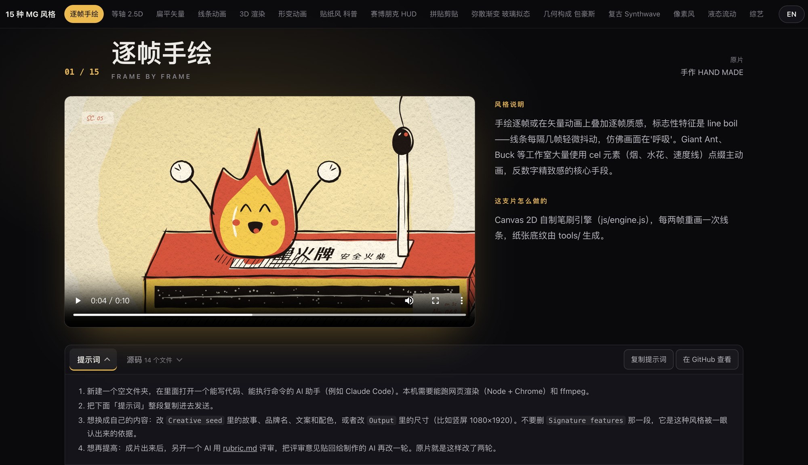

<div align="center">

# 15 种 MG 动态设计风格

**15 种 MG 动态设计风格，每种一支 10 秒成片，全部由 Claude Opus 5.5 写代码做出来。**<br>
**Fifteen styles, one 10-second film each, all made by Claude Opus 5.5 writing code.**

每支片都附风格说明、完整提示词和全部源码。<br>
Every film comes with its style notes, its full prompt and its complete source.

<a href="https://vincentwei1021.github.io/mg-styles-15/?lang=zh"></a>

[**▶ 在线观看全部 15 支（带声音）· Watch online**](https://vincentwei1021.github.io/mg-styles-15/?lang=zh)

[English](README.md) | **简体中文**

   [](LICENSE) [](https://vincentwei1021.github.io/mg-styles-15/?lang=zh)

</div>

> **English readers: see [README.md](README.md) for the full English guide.**<br>
> 中文用户：往下看就是完整的中文说明。

## 这是什么

15 支 10 秒的动态设计短片，每支一种风格，从逐帧手绘到 9:16 竖屏综艺花字。每一支都是 Claude Opus 5.5 按提示词写代码做出来的：画面、动画、配乐和音效都由代码生成。这个仓库把这些全部公开：可以看成片、读这支片怎么做的，也可以复制提示词，拿去做你自己的片子。

- **不用生图、生视频模型**：画面就是代码，用的是 SVG、Canvas、WebGL 和 Three.js，3D 那支用 Blender。少数几支用了 CC0 或公有领域的照片。
- **声音也是代码**：每支片的 `audio.py` 合成自己的配乐和音效，15 支配乐一共用到 103 个真实录制的乐器采样。
- **全部公开**：15 种风格都有成片、风格说明、完整提示词和全部源码。

## 一支片怎么做出来

<p align="center"></p>

每支片都是一个网页，给它一个时间点，它就画出那一帧（`window.renderAt(t)`）。渲染脚本用无头 Chrome 逐帧截图，再用 ffmpeg 把画面和音轨合在一起。只有 3D 那支例外：画面由 Blender 渲染，网页只负责叠上文字和颗粒。每支片都经过两轮评审和修改，AI 评委的终评在 7.57 到 8.21 分之间（满分 10 分）。

## 15 种风格

点成片可以在网页上带声音观看。

<table>
<tr>
<td align="center" valign="top" width="33%"><a href="https://vincentwei1021.github.io/mg-styles-15/?lang=zh#05-cel-boil"></a><br><b>01 · 逐帧手绘 / 线条沸腾</b><br><sub>手作 HAND MADE</sub><br><sub><a href="prompts/05-cel-boil.md">提示词</a> · <a href="demos/05-cel-boil">源码</a></sub></td>
<td align="center" valign="top" width="33%"><a href="https://vincentwei1021.github.io/mg-styles-15/?lang=zh#03-isometric"></a><br><b>02 · 等轴 2.5D</b><br><sub>ISOPOLIS「让城市自己生长」</sub><br><sub><a href="prompts/03-isometric.md">提示词</a> · <a href="demos/03-isometric">源码</a></sub></td>
<td align="center" valign="top" width="33%"><a href="https://vincentwei1021.github.io/mg-styles-15/?lang=zh#01-flat-vector"></a><br><b>03 · 扁平矢量动画</b><br><sub>popwise「One Dot」</sub><br><sub><a href="prompts/01-flat-vector.md">提示词</a> · <a href="demos/01-flat-vector">源码</a></sub></td>
</tr>
<tr>
<td align="center" valign="top" width="33%"><a href="https://vincentwei1021.github.io/mg-styles-15/?lang=zh#02-line-art"></a><br><b>04 · 线条动画</b><br><sub>ATELIER LINEA「一笔画」</sub><br><sub><a href="prompts/02-line-art.md">提示词</a> · <a href="demos/02-line-art">源码</a></sub></td>
<td align="center" valign="top" width="33%"><a href="https://vincentwei1021.github.io/mg-styles-15/?lang=zh#04-3d-render"></a><br><b>05 · 3D 渲染系</b><br><sub>soft.「柔软着陆」 · C4D/Blender 质感</sub><br><sub><a href="prompts/04-3d-render.md">提示词</a> · <a href="demos/04-3d-render">源码</a></sub></td>
<td align="center" valign="top" width="33%"><a href="https://vincentwei1021.github.io/mg-styles-15/?lang=zh#08-morph"></a><br><b>06 · 形变动画</b><br><sub>morphe.「一形万象」</sub><br><sub><a href="prompts/08-morph.md">提示词</a> · <a href="demos/08-morph">源码</a></sub></td>
</tr>
<tr>
<td align="center" valign="top" width="33%"><a href="https://vincentwei1021.github.io/mg-styles-15/?lang=zh#19-paperclip"></a><br><b>07 · 粗描边贴纸人科普 MG</b><br><sub>一部手机里，藏着多少种元素？</sub><br><sub><a href="prompts/19-paperclip.md">提示词</a> · <a href="demos/19-paperclip">源码</a></sub></td>
<td align="center" valign="top" width="33%"><a href="https://vincentwei1021.github.io/mg-styles-15/?lang=zh#22-hud"></a><br><b>08 · 赛博朋克 HUD / FUI</b><br><sub>隼眼-9 · 目标锁定</sub><br><sub><a href="prompts/22-hud.md">提示词</a> · <a href="demos/22-hud">源码</a></sub></td>
<td align="center" valign="top" width="33%"><a href="https://vincentwei1021.github.io/mg-styles-15/?lang=zh#06-collage"></a><br><b>09 · 拼贴剪贴</b><br><sub>NOGGIN 脑洞季刊</sub><br><sub><a href="prompts/06-collage.md">提示词</a> · <a href="demos/06-collage">源码</a></sub></td>
</tr>
<tr>
<td align="center" valign="top" width="33%"><a href="https://vincentwei1021.github.io/mg-styles-15/?lang=zh#12-aurora-glass"></a><br><b>10 · 弥散渐变 / 玻璃拟态</b><br><sub>Aurora「思考，自有光」</sub><br><sub><a href="prompts/12-aurora-glass.md">提示词</a> · <a href="demos/12-aurora-glass">源码</a></sub></td>
<td align="center" valign="top" width="33%"><a href="https://vincentwei1021.github.io/mg-styles-15/?lang=zh#09-bauhaus"></a><br><b>11 · 几何构成 / 包豪斯</b><br><sub>二十拍构成 KONSTRUKTION</sub><br><sub><a href="prompts/09-bauhaus.md">提示词</a> · <a href="demos/09-bauhaus">源码</a></sub></td>
<td align="center" valign="top" width="33%"><a href="https://vincentwei1021.github.io/mg-styles-15/?lang=zh#10-synthwave"></a><br><b>12 · 复古 80s Synthwave / VHS</b><br><sub>NEON DRIVE「霓虹夜驰 1986」</sub><br><sub><a href="prompts/10-synthwave.md">提示词</a> · <a href="demos/10-synthwave">源码</a></sub></td>
</tr>
<tr>
<td align="center" valign="top" width="33%"><a href="https://vincentwei1021.github.io/mg-styles-15/?lang=zh#20-pixel"></a><br><b>13 · 像素风</b><br><sub>PIXEL QUEST 像素冒险</sub><br><sub><a href="prompts/20-pixel.md">提示词</a> · <a href="demos/20-pixel">源码</a></sub></td>
<td align="center" valign="top" width="33%"><a href="https://vincentwei1021.github.io/mg-styles-15/?lang=zh#07-liquid"></a><br><b>14 · 液态流动</b><br><sub>drop.「万物始于一滴」</sub><br><sub><a href="prompts/07-liquid.md">提示词</a> · <a href="demos/07-liquid">源码</a></sub></td>
<td align="center" valign="top" width="33%"><a href="https://vincentwei1021.github.io/mg-styles-15/?lang=zh#18-hanazi"></a><br><b>15 · 综艺花字</b><br><sub>喵呜日记 EP.07 · 9:16 竖屏</sub><br><sub><a href="prompts/18-hanazi.md">提示词</a> · <a href="demos/18-hanazi">源码</a></sub></td>
</tr>
</table>

在网页上，每种风格一节：成片、风格说明、这支片怎么做的；下面点一下就能展开完整提示词和全部源码。页面可以在中英文之间切换。

[](https://vincentwei1021.github.io/mg-styles-15/?lang=zh)

## 用提示词做一支

1. 在一个空文件夹里打开能写代码、能执行命令的 AI 助手（例如 Claude Code）。本机需要 Node、Chrome 和 ffmpeg，3D 那种建议路线要用 Blender。
2. 打开 `prompts/` 里任意一份，把「提示词」那段整段发给它。
3. 想换成自己的内容：每份提示词里只有 `Creative seed` 是具体故事，把里面的故事、品牌名、文案、配色换成你的；也可以把 `Output` 改成竖屏 1080×1920 或改时长。`Signature features` 那段别删，它决定这种风格能不能被一眼认出来。
4. 想做得更好：成片出来后，另开一个 AI 用 [rubric.md](rubric.md) 评审，把评审意见贴回去改一轮。原片就是「制作 → 评审 → 修改」改了两轮。
5. 写一种新风格：照 [template.md](template.md) 填四段（输出规格、技术路线、创意种子、风格特征），其余通用部分照抄。

想省事的话，可以让 AI 直接用这个仓库里的 `harness/render.mjs` 渲染、用 `lib/audio` 做配乐，不用从零搭。

## 跑源码

| 需要 | 用来 | 怎么装 |
|---|---|---|
| Node.js 22.12 或更新 | 渲染脚本和片子用到的 npm 包 | [nodejs.org](https://nodejs.org)，然后 `npm install` |
| Google Chrome | 无头逐帧截图 | macOS 默认位置会自动找到；其他系统用 `MG_CHROME=<路径>` 指定 |
| ffmpeg | 合成画面和音轨 | `brew install ffmpeg` 或 `sudo apt install ffmpeg` |
| Python 3.11 或更新 | 配乐脚本（`audio.py`）和生成素材的脚本 | `pip install -r requirements.txt` |
| Blender | 只有 3D 那支要用 | [demos/04-3d-render/README.md](demos/04-3d-render/README.md) |
| 字体 | 让字形和成片一致 | 不在仓库里，清单见 [assets/fonts/README.md](assets/fonts/README.md) |

```bash
# 在仓库根目录
npm install
pip install -r requirements.txt
python3 demos/01-flat-vector/audio.py          # 合成配乐 → demos/01-flat-vector/out/audio.wav
node harness/render.mjs demos/01-flat-vector   # 逐帧渲染 → demos/01-flat-vector/out/video.mp4
python3 -m http.server 8000                    # 预览：http://localhost:8000/harness/preview.html?demo=01-flat-vector
```

- 页面要从仓库根目录起服务，片子里的路径（`/assets/...`、`/node_modules/...`）都相对根目录。
- 3D 那支的画面是 Blender 渲染的序列帧，步骤见 [demos/04-3d-render/README.md](demos/04-3d-render/README.md)。

## 仓库里有什么

| 路径 | 内容 |
|---|---|
| `index.html`、`site/` | 展示页：每种风格的成片、风格说明、提示词和源码浏览，中英文可切换 |
| `videos/` | 15 支成片和封面帧。8 支直接用原片码流；另外 7 支原片码率 37–100 Mb/s，网页播放太吃带宽，重新压成了 28 Mb/s 以内的 H.264 |
| `prompts/` | 每种风格一份完整提示词，附用法 |
| `demos/<名字>/` | 每支片的源码：画面代码（`index.html` 和 js）、配乐脚本 `audio.py`、时间点 `cues.json`，以及生成片中素材的脚本 |
| `harness/render.mjs` | 渲染脚本：无头 Chrome 逐帧截图，ffmpeg 合成视频和音轨 |
| `harness/preview.html` | 在浏览器里拖时间轴看任意一帧 |
| `lib/audio/` | 配乐和音效的合成工具包 mgaudio，加上 15 支配乐用到的 103 个乐器采样 |
| `assets/` | 片子共用的纹理和 HDRI；字体清单（字体文件不在仓库里） |
| `rubric.md`、`template.md` | 评审用的提示词；写一种新风格的模板 |
| `docs/` | README 里的图：封面、流程图、成片预览和页面截图 |

## 部署自己的一份

1. Fork 这个仓库，或者把全部文件（包括 `.nojekyll`）推到你自己的仓库的 `main` 分支。最大的单个文件 38 MB，在 GitHub 100 MB 的单文件上限以内，不需要 Git LFS。
2. 仓库 Settings → Pages → Build and deployment，Source 选 Deploy from a branch，分支 `main`，目录 `/ (root)`。免费账号只能给公开仓库开 Pages。
3. 一两分钟后打开 `https://<用户名>.github.io/<仓库名>/`。页面会自己识别仓库地址，「在 GitHub 查看」按钮直接跳到对应文件；用自定义域名时，在 `index.html` 的 `<meta name="repo">` 里填上仓库地址。

整个站点约 575 MB，其中视频 420 MB。GitHub Pages 的站点上限是 1 GB，每月流量软上限 100 GB；视频只有点播放才会下载。

## 需要知道的

- 字体文件没有放进仓库（授权各不相同，中文字体也很大）。需要哪些、放在哪里，见 [assets/fonts/README.md](assets/fonts/README.md)。缺字体时浏览器会用系统字体代替，画面里的字形会和成片不一样。
- 同一份提示词每次做出来的片子都不一样。原片每支都经过多轮迭代，一次运行通常达不到原片的完成度。
- 配乐脚本是确定性的：同一环境下重跑，结果每次相同。用 `requirements.txt` 里的版本重跑，有 4 支和成片音轨一致（误差在最低有效位以内），其余 11 支有局部差异，原因可能是数值库版本的变化。
- 做自己的片子时，字体、图片等素材请只用允许商用的授权（CC0、OFL 等），提示词里已经这样要求。

## 许可

- 这个项目自己做的代码、提示词、文档和成片按 [MIT 许可](LICENSE) 发布。
- 第三方文件保留各自的许可：乐器采样（VCSL）、HDRI、纸张纹理、片中的照片，以及 HUD 那支的地图数据（Natural Earth），都是 CC0 或公有领域；`site/vendor/highlight.min.js` 是 BSD-3-Clause（[许可文本](site/vendor/highlight.LICENSE)）；`demos/04-3d-render/assets/mesh/` 和 `demos/08-morph/glyphs.json` 里的字形轮廓取自 SIL OFL 许可的字体，仍按 OFL。
- 字体文件不在仓库里，各有各的许可，清单见 [assets/fonts/README.md](assets/fonts/README.md)。

## 关于

由 [Vincentwei1021](https://github.com/Vincentwei1021) 和 Claude Opus 5.5 一起完成。网页在 https://vincentwei1021.github.io/mg-styles-15/?lang=zh ，仓库在 https://github.com/Vincentwei1021/mg-styles-15 。如果你在这些提示词或代码的基础上做东西，欢迎附上这里的链接。
